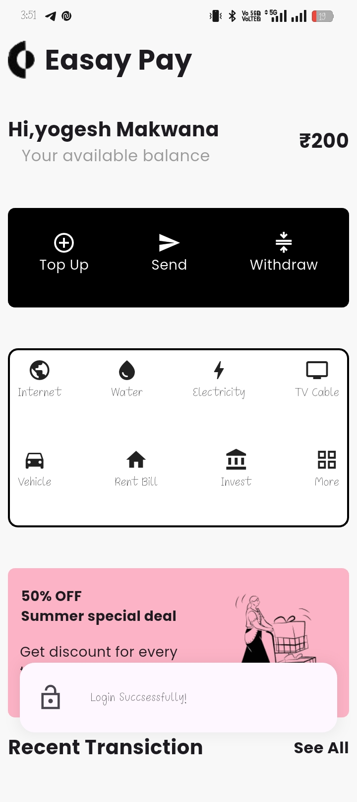
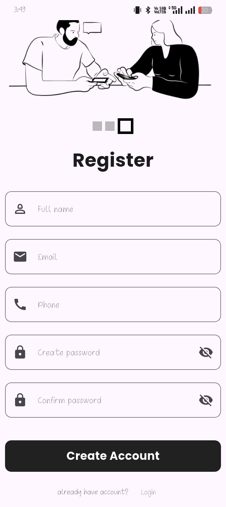
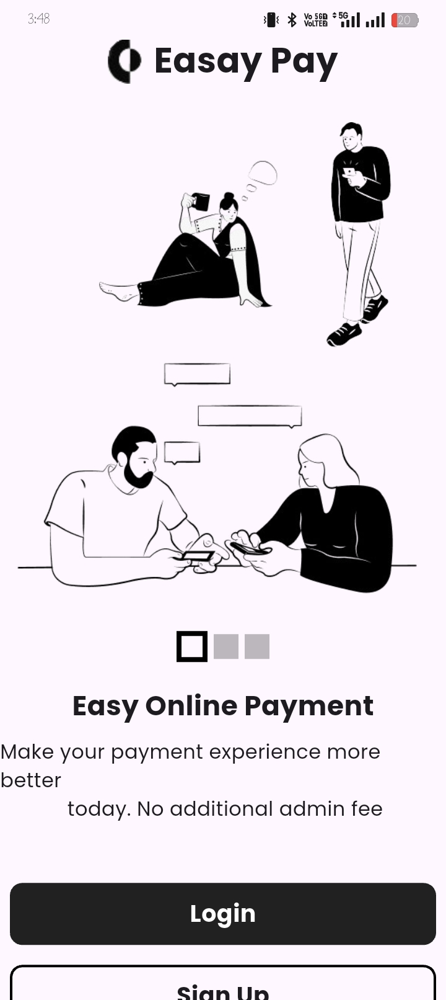

# 💳 Easy Pay - Flutter UI & Authentication App

A modern and minimal **Flutter application** that provides a smooth **payment app UI experience** along with secure **Login & Signup authentication** using form validation.

---

## 📱 App Preview

<p align="center">
 <h3 align="center">🏠 Home Screen & Login Screen</h3>
<p align="center">
  
  
</p>

<h3 align="center">Register and& ⚙️ Main Screen</h3>
<p align="center">
  
  
</p>
</p>

---

## 🚀 Features

* 🎨 **Modern UI Design**

  * Clean and minimal payment app interface
  * Inspired onboarding/payment flow UI

* 🔐 **Authentication System**

  * Login & Signup screens
  * Form validation using `GlobalKey<FormState>`

* ✅ **Form Validation**

  * Email validation
  * Password validation
  * Required field checks

* 🧠 **State Handling**

  * Efficient form handling using Flutter widgets


---

## 🧩 Screens Included

* 🏠 Onboarding / Intro Screen
* 🔑 Login Screen
* 📝 Signup Screen

---

## 🛠️ Tech Stack

* **Flutter** (UI Framework)
* **Dart** (Programming Language)

---

## 📂 Project Structure

```bash
lib/
│── screens/
│   ├── login_screen.dart
│   ├── signup_screen.dart
│   ├── Home_screen.dart
│── main.dart
```

---

## ⚙️ Installation & Setup

1. Clone the repository

```bash
git clone https://github.com/your-username/easy-pay-app.git
```

2. Navigate to project folder

```bash
cd easy-pay-app
```

3. Install dependencies

```bash
flutter pub get
```

4. Run the app

```bash
flutter run
```

---

## 📸 Screenshots Layout

<p align="center">
  
  
</p>

<p align="center">
  
  
  
</p>
<h1>APP Video</h1>

https://github.com/user-attachments/assets/d4d7c352-3488-4b12-a859-567a520fafab


---

## 🎯 Key Implementation

### 🔹 Form Validation Example

```dart
final _formKey = GlobalKey<FormState>();

if (_formKey.currentState!.validate()) {
  // Proceed with login/signup
}
```

---

## 💡 Future Improvements

* 🔗 API Integration (Real Payments / Backend)
* 💾 User session management
* 🔐 Firebase Authentication
* 🌙 Dark Mode support
* 📊 Transaction history UI

---

## 👨‍💻 Developer

**Yogesh Makwana**
🎓 BCA Student | Flutter Developer

---

## ⭐ Support

If you like this project:

* ⭐ Star this repository
* 🍴 Fork it
* 🤝 Contribute

---

## 📄 License

This project is licensed under the MIT License.

---
